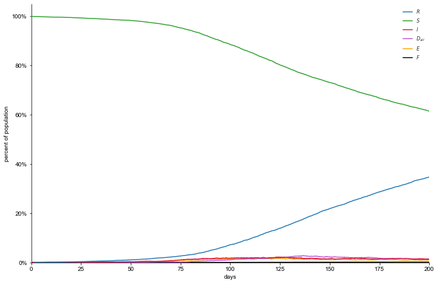
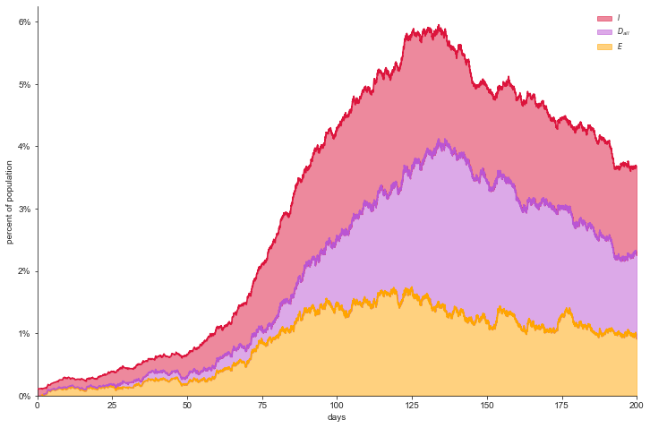
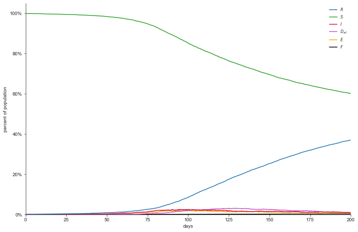
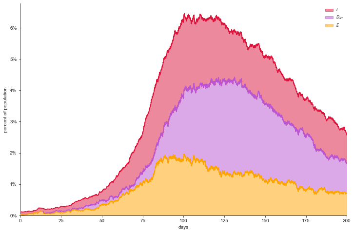
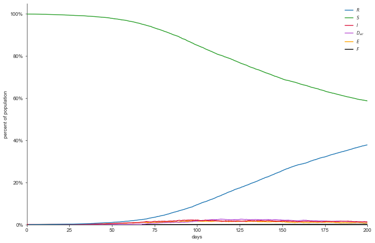
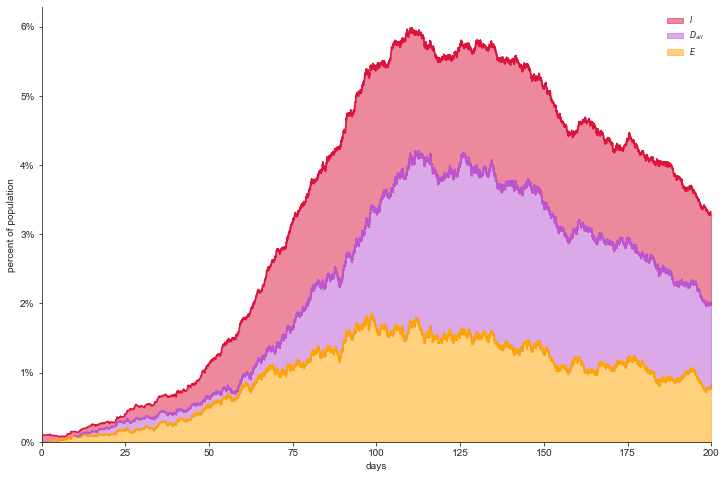
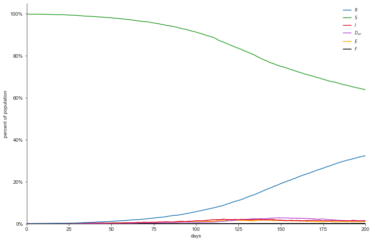
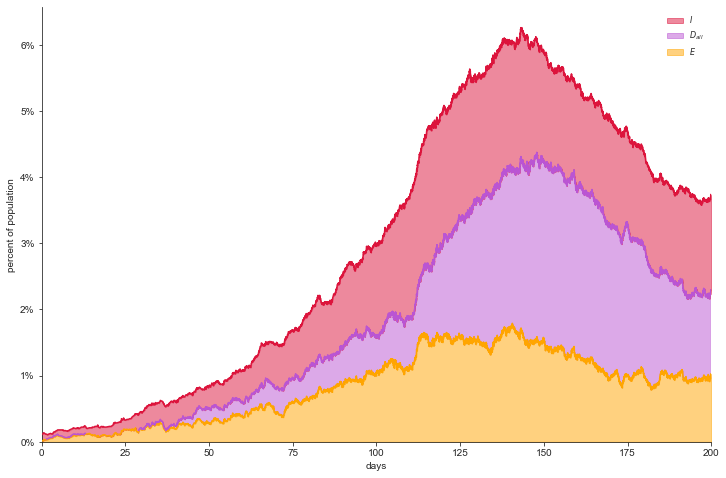

# Social Distancing By Occupation

## Overview
This project is the setup and execution of an agent-based simulation of social distancing practices using income and occupation as dependent variables. We received data from a range of government sources to inform contextual characteristics of different occupations and control data to inform our model. The simulations are driven by [Ryan McGee's SERIS Model](https://github.com/ryansmcgee/seirsplus).

### Our Model
The model our simulations assume is inspired from [Reluga's Game Theory of Social Distancing in Response to an Epidemic](https://www.ncbi.nlm.nih.gov/pmc/articles/PMC2877723/). Individuals social distance proportional to their income. Income here is a implicative factor towards one's ability to go to work. Each occupation has a different weight in the [Barabasi-Albert Graph](https://en.wikipedia.org/wiki/Barab%C3%A1si%E2%80%93Albert_model) and different transmission rates. This graph was generated by merging the Barabasi-Albert Graphs for individual occupations following the scheme defined in [Held, Dockhorn, and Kruse's Paper](https://www.researchgate.net/publication/271200973_On_Merging_and_Dividing_of_Barabasi-Albert-Graphs).

### Organization
This project is organized into two jupyter notebooks. `regression.ipynb` retreives regression data on from the following states (NJ, UT, GA, WA). `buildData.ipynb` generates pandas dataframes on charactersitics of occupations and their average income to set up  the simulation. The pickles folder contains pre-generated pickles of variables in the notebook file. This allows users to to jump straight to the simulation (*5. Running Simulations* in `buildData.ipynb`).   

## Regression
The regressions.ipynb file can calculate regressions on a number of data fields including social distancing data, county income and county employment. We regress county income and employment controls on social distancing and then implement the coefficient of income into our SEIRS and income model.$\beta$

## Simulation
We currently have two simulations. A Stimulus Check distribution sim and a mass layoff simulation. These situations will affect individuals savings by either removing their stream of income, or adding a discrete boost to one's savings. These were then compared to a baseline progression of the disease defined by our model.

### Baseline
All Features             |  Relevant Infection Features
:-------------------------:|:-------------------------:
  |  

### Layoffs for ~10% of pop
All Features             |  Relevant Infection Features
:-------------------------:|:-------------------------:
  |  

### Paycut
All Features             |  Relevant Infection Features
:-------------------------:|:-------------------------:
  |  

### Stimulus
All Features             |  Relevant Infection Features
:-------------------------:|:-------------------------:
  |  

## Data
BEA County Employment: https://www.bea.gov/data/employment/employment-by-state 
BEA County Income: https://www.bea.gov/data/income-saving/personal-income-county-metro-and-other-areas  \
Google Social Distancing Data: https://www.google.com/covid19/mobility/  \
NYT Susceptiblity Data: https://www.nytimes.com/interactive/2020/03/15/business/economy/coronavirus-worker-risk.html  \
Department of Labor ONet Job Characteristics and Information: https://www.onetcenter.org/database.html#individual-files 
Industries Hit Hardest by Covid: https://www.usatoday.com/story/money/2020/03/20/us-industries-being-devastated-by-the-coronavirus-travel-hotels-food/111431804/
